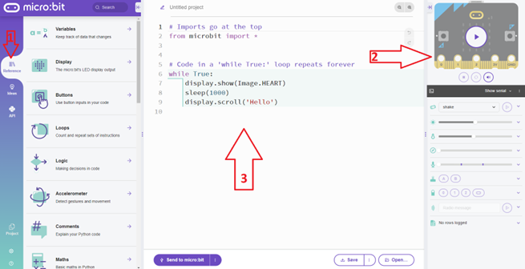

# Activity: De programmeeromgeving

Er bestaan verschillende manieren om de Micro:Bit in de Python programmeertaal te programmeren. Dit kan via Visual Studio Code, dit moet je dan zelf downloaden en installeren op uw computer, maar er bestaat ook een online omgeving voor MicroPython voor de Micro:Bit. Op die manier hoef je niets te installeren op uw computer. Ga hiervoor naar de website : https://microbit.org/ en klik bovenaan op "Let's code" en kies op die pagina voor de link : Python editor.

Python programmeeromgeving.")

Herken hierop:
<ol>
  <li>Reference : Python bibliotheek</li>
  <li>Simulator</li>
  <li>Programmeer Python code zone</li>
</ol>