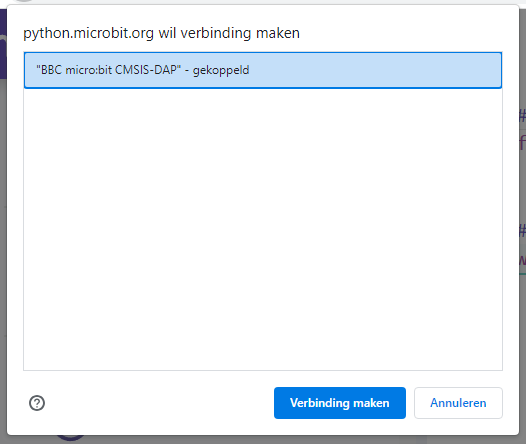

# Eerste keer connectie tussen Micro:Bit en de computer

De Micro:Bit wordt via een USB-kabel verbonden met de computer. Op die computer wordt de software ontwikkelomgeving opgestart en wordt de logica van het programma geschreven. Om het programma erin te laden wordt de micro:bit verbonden met de PC of laptop waarmee het
programma geschreven is. Dit gebeurt met een USB-kabel. Aan de zijde van de micro:bit is het een
USB-micro verbinding.

Stappenplan voor de pairing en connectie (moet maar 1 keer gebeuren): Klik op de drie bolletjes naast de knop: "Stuur naar micro:bit" en klik op "Verbinden"

Nadien is het voldoende om de knop: "Stuur naar micro:bit" te gebruiken om de geprogrammeerde code in de Micro:Bit te programmeren en die door de Micro:Bit te laten uitvoeren.

***

