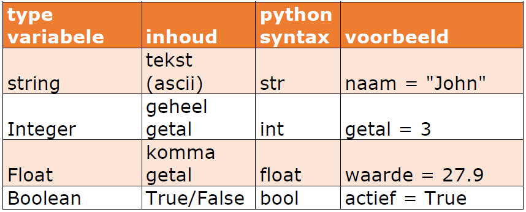

# MicroPython code

**Initialisatie** : Omdat we werken met een Micro:bit moeten we dit steeds aangeven bovenaan de code.  Importeer steeds (*) om (bijna) alle (hardware)mogelijkheden van de Micro:Bit te gebruiken. Doe dit door bovenaan in de Python code te schrijven :

```python
from microbit import *
#Dan de rest van de python code
```

Binnen een programmeertaal zijn een aantal zaken belangrijk en keren steeds terug in andere programmeertalen. Dit zijn:
<ol>
  <li>Commentaar in Python begint met een #.</li>
  <li>Variabelen: reserveren van geheugenplaats om data (tijdelijk) in te bewaren</li>
  <li>Soorten variabelen : type : 
    <ul>
        <li>Getallen zonder komma: integer</li>
        <li>Getallen met komma: float</li>
        <li>Boolean: variabele die maar twee waarden kan bevatten: 1/0 of True/False </li>
        <li>String: variabele die tekst kan bevatten (groepering van characters) </li>
        <li>char: variabele die maar 1 character/symbool kan bevatten </li>
    </ul>
  </li>
  <li>Iteraties: herhalingen:
    <ul>
        <li>While Loop: herhaling die steeds wordt herhaald als voorwaarde True is (aantal loops is niet gekend)</li>
        <li>For Loop: herhaling die steeds wordt herhaald als voorwaarde True is (aantal loops is gekend)</li>
    </ul>
  </li>
  <li>Selecties: De <b>als</b> vraag. Als een variabele voldoet aan een voorwaarde dan wordt iets uitgevoerd, indien niet dan kan er iets anders worden uitgevoerd. In programmeertalen is dit meestal het IF-statement</li>
  <li>Converties of type casting: omzetting van ene type naar een ander type variabele</li>
  <li>Concatenatie van strings: samenvoegen van twee strings tot 1 string (aan elkaar kleven)</li>
  <li>Maken van eigen functies met daarbij parameters en return waarden</li>
</ol>

## Iets meer over variabelen:

Tekst die bestaat uit meerdere tekens, omsloten door enkele of dubbele aanhalingtekens wordt een **string** genoemd . (“string”) <br>
Een getal kan een **integer** zijn (geheel getal) of een **float** (een komma getal)( Let op! moet een punt zijn i.p.v. een komma)<br>
Een **boolean** is een variabele die maar twee toestanden kent: 0 of 1 , soms wel als **False** en **True** uitgedrukt.  <br>
**Variabele :** We kunnen ook iets opslaan in het geheugen van de computer (= declaratie = reservatie van geheugenplaatsen). Aantal geheugenplaatsen is afhankelijk van het type variabele (int, float, string, bool). Een variabele krijgt steeds een (logische)naam die de programmeur zelf kan kiezen.



## Iets meer over iteraties:

Door Python code te schrijven kan een statement, instructie één keer worden uitgevoerd, door die code op te nemen in een While-True statement kan een oneindige herhaling worden gecreëerd waarbij dit statement telkens zal worden herhaald. (zie verder) 

## Iets meer over selecties:

Door gebruik te maken van vergelijkingsoperatoren zoals gelijkaan (==), groter dan (>), kleiner dan (<), ... kan een voorwaarde worden opgesteld om iets te doen, of iets niet te doen. Op deze logica is het digitaal programmeren gebouwd. In python code, net zoals in vele andere talen wordt hiervoor het IF-statement gebruikt. Hierbij zijn wel een aantal varianten mogelijk en kunnen er complexere voorwaarden worden geprogrammeerd door gebruik te maken van de logische operatoren. (zie verder in code voorbeelden)