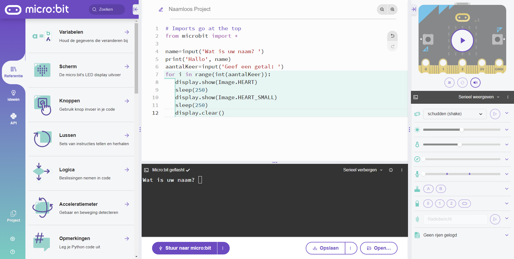

# Serial communication

Communicatie µBit via USB kabel (via console/terminal) -statement: input - print

Het komt zeer veel voor dat er data moet worden uitgewisseld tussen de µBit en de buitenwereld. De meest eenvoudige buitenwereld is de computer waarop de µBit is op aangesloten via een USB kabel. Deze wordt gebruikt om de µBit te programmeren. Maar ook tijdens het runnen van een programma op de µBit is er soms nood om te communiceren met het programma op de µBit. Dit kan in twee richtingen. Data van µBit naar computer (**print**), of data van de computer naar de µBit (**input**). Volgend voorbeeld toont beide mogelijkheden in volgende stappen: 
<ul>
<li>µBit vraagt (<b>input</b>) aan de computer de naam van de gebruiker</li>
<li>µBit slaat die string op in een variabele</li>
<li>µBit zend (<b>print</b>) die inhoud van die variabele terug naar de console</li>
<li>µBit vraagt (<b>input</b>) aan de computer om een getal in te geven</li>
<li>µBit slaat die string (let op : getal wordt hier gezien als een string!!) op in een variabele</li>
<li>µBit zal die laatste string-variabele omvormen naar een integer-variabele om het  aantal keer een For-Loop moet worden doorlopen.</li>
</ul>

::: warning
Let op in de code: het inlezen (input) is steeds van het type String. Aangezien we dit als een getal willen gebruiken moet hier dus een typecasting gebeuren van een string naar een integer. Let wel, dit kan fout lopen indien er geen omzetbaar symbool wordt ingegeven.
:::

```python
from microbit import *

name=input('Wat is uw naam? ')
print('Hallo', name)
aantalKeer=input('Geef een getal: ')
for i in range(int(aantalKeer)):
  display.show(Image.HEART)
  sleep(250)
  display.show(Image.HEART_SMALL)
  sleep(250)
  display.clear()
  
```
