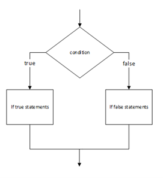

# Events

Gebeurtenis op basis van drukknoppen.

Binnen de oneindige WHILE-loop kan er steeds nagegaan worden of een drukknop is ingedrukt. Hiervoor gebruiken we een IF-statement (keuze optie: levert altijd een True/False op). Een IF-statement kan op verschillende manieren worden gebruikt, zo is er ook een ELSE mogelijkheid, of zelfs combinaties. We houden het hier eenvoudig.

Binnen de MicroPython van de Micro:Bit kan gebruik gemaakt worden van:

**WAS_pressed**: statements worden slechts één keer uitgevoerd (ook bij blijvend drukken).<br>
**IS_pressed**: statements worden meerdere keren uitgevoerd bij blijvend drukken.



```python
from microbit import *
while True:
  if button_a.was_pressed():
    display.scroll('knopA')
  if button_b.is_pressed():
    display.scroll('knopB')
```
::: tip
Blijf eens op een knop drukken om het verschil te zien in voorgaande.
:::
